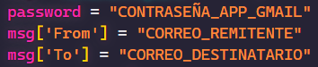
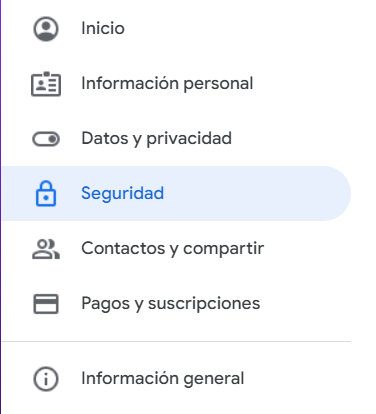
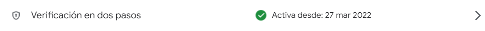
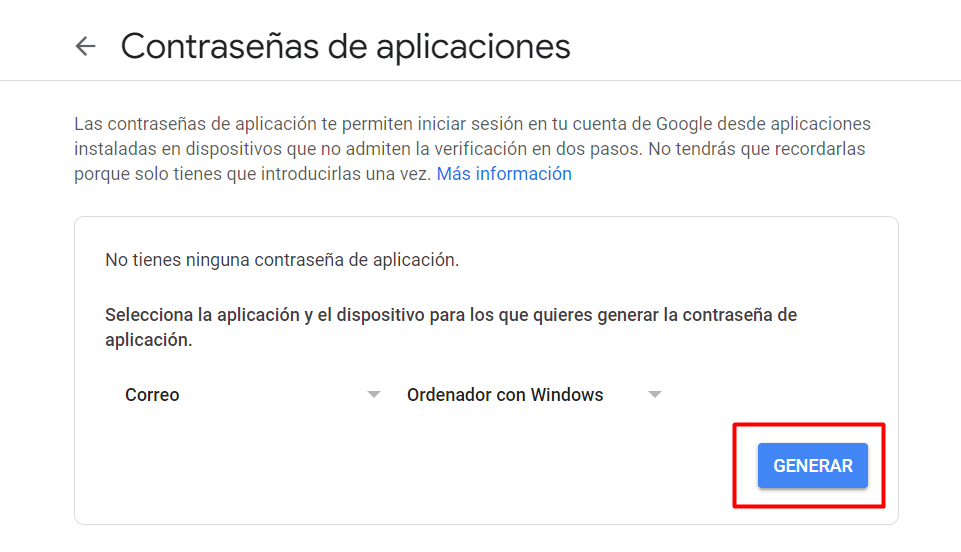
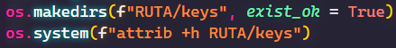

Al ejecutar el script se graban las teclas pulsadas en un archivo llamado keys que se encuentra en una carpeta oculta

# Uso
En el remitente escribimos el correo desde el que queremos que se envíen los correos

Accede a los ajustes de tu cuenta de Gmail y asegurate de que la verificación en dos pasos está activada

Para poder usar la contraseña, accede a <a href="https://myacount.google.com/apppasswords">Contraseñas de aplicaciones</a>

Copia la clave generada en el valor de la variable password del script de envío
Cambia el valor de "RUTA" en ambos scripts por la ruta que quieras, es recomendable usar la ruta "C:/Users/{user}/.../keys" donde {user} es el usuario del sistema, para evitar errores en la creación de la carpeta oculta por la falta de permisos

## Script de envío
Cada 60 segundos se enviará el contenido del archivo keys en texto plano al correo que hayas elegido
Puedes cambiar la frecuencia de envío en "time.sleep(INTERVALO_EN_SEGUNDOS)"
